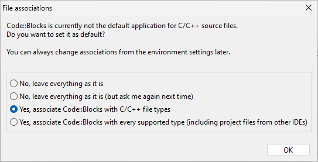
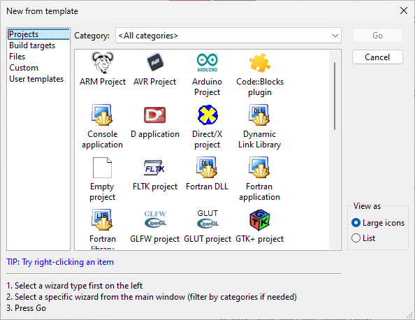
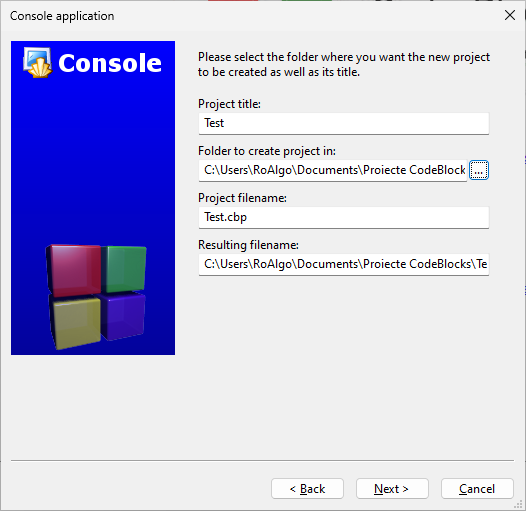
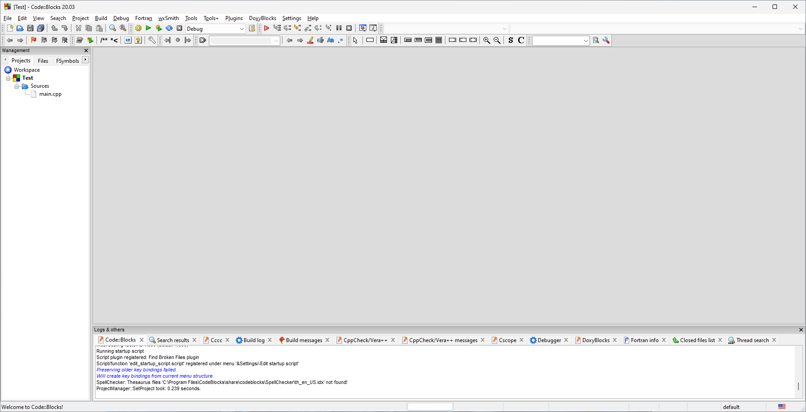
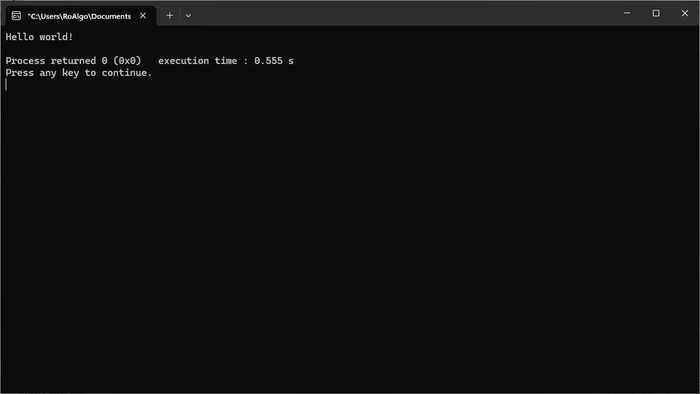
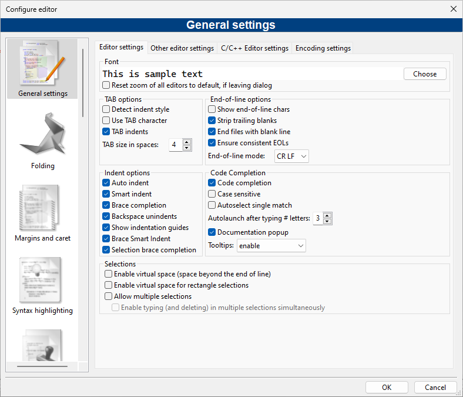
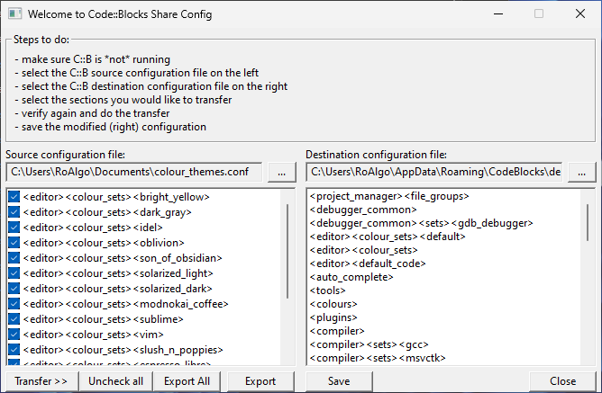

## Instalare

Pentru a instala Code::Blocks:

1. Mergi pe site-ul oficial, la secțiunea Downloads și apoi apasă "Download the
    binary release".

    [Link direct :material-open-in-new:](https://www.codeblocks.org/downloads/binaries/#imagesoswindows48pnglogo-microsoft-windows){ .md-button .md-button--primary }

2. Alege `codeblocks-20.03-setup.exe`. Ambele mirror-uri sunt bune, însă
    recomand Sourceforge. Dacă vrei să ai o instalare portabilă, alege
    `codeblocks-20.03-nosetup.zip`.

    [Descarcă Code::Blocks 20.03 :material-open-in-new:](https://sourceforge.net/projects/codeblocks/files/Binaries/20.03/Windows/codeblocks-20.03-setup.exe/download){ .md-button .md-button--primary }

    !!! warning "Atenție"

        Nu alege variantele cu MinGW. Acele installere vin cu o versiune învechită de
        MinGW (vin cu GCC 8.1, mai precis). Pentru cea mai bună experiență, avem 
        nevoie de cel mai nou compilator. [Vezi instrucțiuni aici :material-open-in-new:](./../../compilers/windows/mingw64.md) pentru cum poți instala ultima versiune de GCC.

3. După ce s-a descărcat, rulează installerul (care ar trebui să fie numit
    `codeblocks-20.03-setup.exe`). Procesul nu durează mult, de cele mai multe
    ori este un minut. Setările implicite sunt bune, așa că poți apăsa Next până
    când s-a terminat de instalat.

## Configurare și utilizare

De fiecare dată când vei deschide Code::Blocks, vei vedea asta:
<figure markdown="span">
{ loading=lazy }
</figure>

Selectează GNU GCC Compiler (care ar trebui să fie implicit), apasă pe Set as
default și apoi apasă OK.

Prima dată când deschizi acest editor, această fereastră va apărea:
<figure markdown="span">
{ loading=lazy }
</figure>

Selectează "Yes, associate Code::Blocks with C/C++ file types", care înseamnă
faptul că fiecare fișier C++ se va deschide în Code::Blocks. Apoi apasă OK.

Ești întâmpinat de această fereastră albă orbitoare:
<figure markdown="span">
{ loading=lazy }
</figure>

Pașii pentru a crea un proiect sunt:

1. Fie te poți duce în bara de meniu și să alegi File > New > Project, fie poți
    din Start here (prima fereastră care apare) și apoi apasă Create a new
    project.
2. Indiferent de metoda aleasă, ajungi la această fereastră:
    <figure markdown="span">
    { loading=lazy }
    </figure>
    Alege prin dublu clic Console application (engl. Aplicație în consolă).
3. În acest stadiu, vei fi întâmpinat de "wizard". Acesta te va ghida în
    crearea unei aplicații noi. Așa arată:
    <figure markdown="span">
    { loading=lazy }
    </figure>
    Apasă Next.
4. De aici, alege C++ (este o introducere de C++, la urma urmei) și apasă Next.
    <figure markdown="span">
    { loading=lazy }
    </figure>
5. Aici este pasul unde alegi titlul proiectului, precum și folderul proiectului.
    <figure markdown="span">
    { loading=lazy }
    </figure>

    !!! tip "Sfat"

        Fă numele proiectului sugestiv, chiar numele problemei la care lucrezi
        acum, pentru că nu este prea drăguț să umpli printr-o mare de proiecte
        care au nume similare cu "fsdjkfdkjdfsjhsdaf".

        De asemenea, recomand să grupezi toate proiectele într-un folder special. 
        Este mult mai ușor să găsești un proiect dacă se află într-un singur loc. 
        Numele sugestive ajută și ele aici.

    În cazul meu, eu am completat astfel:
    <figure markdown="span">
    { loading=lazy }
    </figure>
6. Aici este pasul unde alegem compilatorul. Dacă ai instalat GCC și îl
    recunoaște corespunzător, atunci prima opțiune va fi GNU GCC Compiler. Lasă
    tot bifat așa cum e implicit și apasă Next și apoi Finish la următorul ecran.
    <figure markdown="span">
    { loading=lazy }
    </figure>

Dacă ai făcut totul corect, fereastra ta ar trebui să arate astfel:
<figure markdown="span">
{ loading=lazy }
</figure>

Pentru a vedea dacă totul merge, apasă pe `main.cpp` din bara laterală. Ar
trebui să vezi următorul cod în editor:

```cpp
#include <iostream>

using namespace std;

int main()
{
    cout << "Hello world!" << endl;
    return 0;
}
```

Apasă pe ++f9++ (sau Build > Build and Run din bara de meniu). Acest pas va
compila și rula programul tău, și este o tastă foarte folosită de către tine în
viitor. Dacă ai un compilator funcțional și nu ai erori, o să vezi următoarea
fereastră:
<figure markdown="span">
{ loading=lazy }
</figure>

Felicitări! Compilatorul GCC funcționează și ai rulat primul tău program de C++.

Acum a venit timpul să configurăm Code::Blocks. În primul rând, vrem să facem
experiența de editat mai bună. Pentru acest lucru, mergem la Settings > Editor
din bara de mediu.

1. Courier New nu este un font prea legibil, așa că recomand să îl schimbi,
    apăsând pe butonul Choose, în Cascadia Mono, Cascadia Code (adaugă ligaturi,
    dar în rest este identic cu Cascadia Mono) sau Consolas. Poți seta de
    asemenea și mărimea implicită (10 este mult prea puțin, chiar și dacă ai pe
    un monitor mare, ar trebui 12 minim).

2. În același loc, la Indent Options bifează Show indentation guides. Setarea
    aceasta face ca fiecare nivel de indentare să fie marcat cu o linie gri
    verticală, deci este mai ușor să vezi unde începe și se termină o acoladă.

3. Bifează și "Ensure consistent EOLs", ca să nu se amestece sfârșiturile de
    linii.

    În total, așa ar trebui să arate momentan pagina:
    <figure markdown="span">
    { loading=lazy }
    </figure>

4. Acum ne mutăm pe tab-ul cu Other editor settings. Aici vom configura
    următoarele chestii:

    1. Bifează Word Wrap. Această funcție încadrează textul automat în caz că
        este prea lung.
    2. Este opțional, însă poți bifa Highlight line under caret, care
        evidențiază linia pe care ești în momentul de față.
    3. Acest lucru este preferință personală, însă poți face fontul să se
        randeze mai bine pe ecran. La Technology alege DirectWrite, și la Font
        quality alege LCD optimized (mă îndoiesc că ai un monitor cu tub ca pe
        vremuri).

5. Acum mergem la Margins and caret, unde vom face două schimbări:

    1. Activăm Dynamic setting, deoarece bara care arată numărul de linie este
        mult prea groasă.
    2. La Right margin hint, selectează Visible line. La a 80-a coloană, arată
        o linie verticală. Dacă nu treci de acea linie, atunci codul tău va fi
        mai ușor de citit, pentru că nu vei avea linii kilometrice.

6. Un aspect foarte disputat la Code::Blocks este tema sa implicită, cu albul
    orbitor. Din păcate, Code::Blocks nu vine cu o temă întunecată, mai
    prietenoasă cu ochii noaptea (de fapt, nu vine cu alte teme în afară de cea
    standard). Pentru a rezolva această problemă:

    1. Mergi la [această pagină arhivată](http://web.archive.org/web/20200225073702/http://wiki.codeblocks.org/index.php?title=Syntax_highlighting_custom_colour_themes). Acolo o să vezi mai multe teme.
    2. Descarcă următorul fișier de configurare (care este exact cel de pe site,
       însă prezervat pentru conveniența cititorului):

        [colour_themes.conf :material-download:](./codeblocks/colour_themes.conf){ .md-button .md-button--primary }

    3. **Închide Code::Blocks**. Acest pas este critic, deci asigură-te că nu ai
       vreo fereastră ascunsă.
    4. Caută locația unde este instalat Code::Blocks și deschide folderul
       corespunzător. Ar trebui să fie în `C:\Program Files\CodeBlocks`.
    5. Ai un executabil numit `cb_share_config.exe`. Rulează-l.
    6. În stânga (la sursă), selectează fișierul `colour_themes.conf` pe care
       l-ai descărcat mai înainte. În dreapta, alege fișierul implicit. Acesta se află la `C:\Users\{nume utilizator}\AppData\Roaming\CodeBlocks\default.conf`.
    7. În partea stângă, bifează tot din listă.

        Asigură-te că fereastra ta arată așa:
        <figure markdown="span">
        { loading=lazy }
        </figure>

    8. Apasă Transfer și răspunde cu Yes când ți se cere.
    9. Apasă pe Save.
    10. Închide programul și deschide Code::Blocks înapoi.
