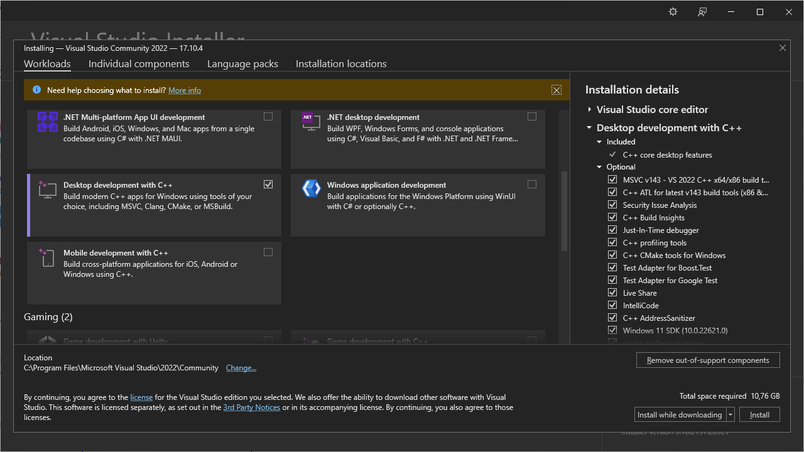
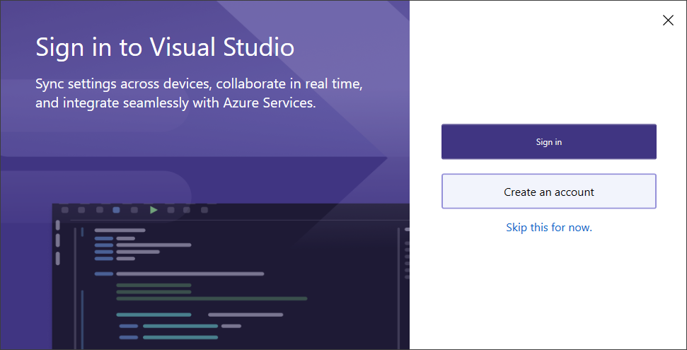
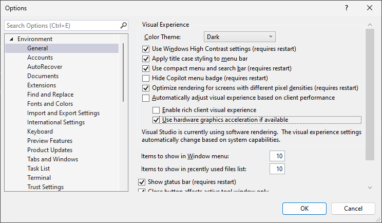

Pentru a instala:

1. Descarcă executabilul de setup de aici (Visual Studio 2022 Community, este
   varianta gratuită și arhisuficientă pentru nevoile tale):
   
    [Descarcă Visual Studio 2022 Community :material-download:](https://c2rsetup.officeapps.live.com/c2r/downloadVS.aspx?sku=community&channel=Release&version=VS2022&source=VSLandingPage){ .md-button .md-button--primary }

2. Rulează executabilul. La prima fereastră cu titlul Visual Studio Installer,
   apasă pe butonul Continue. După ce se descarcă installer-ul oficial, o să ai
   o fereastră similară cu asta:

    <figure markdown="span">
    { loading=lazy }
    </figure>

3. Visual Studio 2022 are conceptul de _workload_. Fiecare workload este
   specializat pe un anumit domeniu sau limbaj și instalează un set anume de
   componente. Majoritatea workload-urilor sunt țintate către cei pe C#, însă pe
   noi ne interesează workload-ul **Desktop development with C++**. Așa ar
   trebui să arate fereastra ta după ce ai selectat opțiunea asta:

    <figure markdown="span">
    { loading=lazy }
    </figure>

4. Apasă butonul de install și așteaptă să se instaleze. După cum se poate vedea
   în ultima poză, este destul de mare Visual Studio. Totuși, după ce se termină
   de instalat, se deschide singur. La această fereastră, ori te poți loga cu
   contul de GitHub sau Microsoft, ori poți să dai skip, nu e necesar să ai un
   cont pentru a putea folosi Visual Studio.

    <figure markdown="span"> 
    { loading=lazy }
    </figure>

5. La următoarea fereastră, poți să lași setările implicite sau să schimbi tema.
   Tot ce mai rămâne să faci este să apeși pe "Start Visual Studio" și să
   aștepți puțin în timp ce se configurează. Dacă tot procesul a mers cum
   trebuie, se va deschide această fereastră:

    <figure markdown="span">
    { loading=lazy }
    </figure>

Felicitări! Ai instalat Visual Studio 2022. Acum vremea să îl configurăm și
folosim.

Pentru a crea un proiect C++, facem următorii pași:

1. La fereastra de mai sus (care apare în momentul în care deschizi Visual
   Studio 2022), apasă pe "Create a new project".
2. O să fii întâmpinat de mai multe șabloane pe care le poți folosi:

    <figure markdown="span">
    { loading=lazy }
    </figure>

3. Avem două șabloane care ni-s utile:
    1. Console App, care gestionează proiectul folosind MSBuild și este specific
       Visual Studio;
    2. CMake Project, care poate rula pe mai multe platforme (oriunde este
       suportat CMake, inclusiv Linux și *BSD) și nu este limitat de Visual
       Studio.

    Dacă nu ai nevoie să editezi proiectul și cu alte editoare/IDE-uri sau pe
    alte platforme, Console App este suficient, așa că asta vom folosi și noi
    acum. Dă dublu click pe Console App (sau selectează-l, apoi apasă Next).

4. Ajungem la această fereastră:

    <figure markdown="span">
    { loading=lazy }
    </figure>

    În primul rând, avem numele proiectului.

    !!! tip "Sfat"

        Fă numele proiectului sugestiv, chiar numele problemei la care lucrezi
        acum, pentru că nu este prea drăguț să umpli printr-o mare de proiecte
        care încep cu ConsoleApplication.

    Apoi avem locația acestuia. Calea implicită este `$USER\source\repos`, dar
    poți să-l pui undeva separat (recomand acest lucru). După locație avem
    numele soluției. O soluție este un container pentru unul sau mai multe
    proiecte. Poți selecta și dacă vrei să fie soluția și proiectul în același
    director (caz în care numele proiectului este același cu cel al soluției).

    !!! warning "Atenție"

        Nu există soluții dacă alegi șablonul cu CMake. Există moduri prin
        care poți emula acest lucru, dar cea mai simplă cale (fără integrarea
        de care ai parte cu Console App) este să pui în directoare separate
        (de fapt, asta face și o soluție).

    !!! tip "Sfat"

        Nu este obligatoriu, însă dacă lucrezi de pe un site (e.g. Kilonova)
        sau faci probleme de la un concurs, recomand să le grupezi într-o
        soluție. Zece soluții sunt mult mai ușor de gestionat decât 40 de
        proiecte, dacă este nevoie să cauți pe viitor rezolvările la o
        problemă.

    De dragul exemplului, voi numi proiectul "ConsoleApplication1" sub locația
    implicită și pun proiectul în același loc cu soluția. Dacă totul a mers cum
    trebuie, vei vedea o fereastră similară cu asta:

    <figure markdown="span">
    { loading=lazy }
    </figure>

Poți acum să apeși ++ctrl+f5++ (Start without Debugging) și vei vedea că rulează
programul și afișează Hello World. Asta înseamnă și că ai compilatorul MSVC
funcțional.

!!! tip "Sfat"

    Obișnuiește-te cu această scurtătură (++ctrl+f5++), o să o folosești
    _foarte des_. În timp, uită-te prin meniuri și învață niște scurtături
    comune pentru acțiunile pe care le faci cele mai des, așa vei deveni
    mai rapid și mai fluid la a folosi Visual Studio. [Vezi această
    pagină](https://visualstudio.microsoft.com/keyboard-shortcuts.pdf)
    care este cheatsheet de la Microsoft cu cele mai comune scurtături
    specifice VS. Scurtăturile generale gen ++ctrl+c++, ++ctrl+v++,
    ++ctrl+s++ etc. le poți găsi și din VS și sunt în mare parte general
    valabile.

Acum, timpul pentru niște chestii pe care le poți face ca să îmbunătățești
performanța (VS este un program mare și ia multă
memorie, deci poate fi uneori încet):

1. Visual Studio deschide automat fișierele care au fost deschise în vechea
   sesiune. Din această pricină, o soluție poate lua mai mult să se deschidă,
   pentru că toate fișierele sunt analizate în paralel. Pentru a dezactiva acest
   comportament:

    1. Apasă în meniu pe Tools, apoi Options (ultima din dropdown, cea cu o
       rotiță zimțată);
    2. Du-te la Projects and Solutions, apoi la General și dezactivează "Reopen
       documents on solution load". În final, ar trebui să arate similar cu
       asta:

        <figure markdown="span">
        { loading=lazy }
        </figure>

    În schimb, putem să ne folosim de ce se află la Edit > Go To. Aici se află
    toate opțiunile:

    <figure markdown="span">
    { loading=lazy }
    </figure>

    Cea mai importantă din ele este ++ctrl+t++ care funcționează ca un Go To
    generalizat. Pentru fișiere recente avem ++ctrl+1++, ++ctrl+r++, și pentru
    fișiere în general avem ++ctrl+shift+t++. Ocazional folosesc și ++ctrl+1++,
    ++ctrl+s++ ca să caut un simbol (o funcție, o variabilă etc.), ceea ce se
    poate dovedi util la fișiere mari.

2. Dacă instalezi extensii, acestea sunt activate când este nevoie. Problema la
   această abordare este că dacă ai una sau mai multe extensii care rulează
   imediat la pornire, atunci programul se va încetini. Poți folosi Help >
   Visual Studio Performance Manager pentru a inspecta de ce VS este încet.
3. Visual Studio își ajustează efectele bazat pe performanța clientului, însă
   acest lucru de cele mai multe ori încetinește tot. Pentru a rezolva acest
   lucru, mergem la Tools > Options și apoi la Environment > General. Opțiunea
   pe care vrem să o dezactivăm se cheamă "Automatically adjust visual
   experience based on client performance", împreună cu "Enable rich client
   visual experience". Ultima opțiune, cea cu accelerarea hardware, trebuie să
   rămână activă, pentru a nu randa software Visual Studio (excepție fiind dacă
   ai un calculator cu o placă video _foarte_ slabă sau dacă ești pe mașină
   virtuală). După ce ai terminat, fereastra trebuie să fie similară cu asta:

    <figure markdown="span">
    { loading=lazy }
    </figure>

4. Windows Defender rulează constant în fundal pentru a ne proteja de viruși.
   Totuși, asta impactează negativ performanța pentru că scanează toate
   directoarele din sistem, inclusiv cele ale lui Visual Studio și cele ale
   proiectelor noastre. Pentru acest lucru, trebuie să facem excepții. Am creat
   un script de PowerShell care să automatizeze acest proces. Acesta poate fi
   descărcat de aici:

    [Descarcă script :material-download:](./vs2022/ImproveVS2022.ps1){ .md-button .md-button--primary }

    <details><summary>Scriptul complet (salvat în ImproveVS2022.ps1)</summary>
    ```powershell
    if (-not ([Security.Principal.WindowsPrincipal] [Security.Principal.WindowsIdentity]::GetCurrent()).IsInRole([Security.Principal.WindowsBuiltInRole] "Administrator"))
    {
        Write-Host "Ruleaza acest script ca Administrator." -ForegroundColor Red
        exit
    }

    $userPath = $env:USERPROFILE
    $appdataLocal = "$userPath\AppData\Local"
    $appdataRoaming = "$userPath\AppData\Roaming"
    $programData = "C:\ProgramData"
    $programFiles = "C:\Program Files"
    $programFilesX86 = "$programFiles (x86)"

    $pathExclusions = @(
        'C:\Windows\Microsoft.NET',
        'C:\Windows\assembly',
        "$userPath\.dotnet",
        "$userPath\.librarymanager",
        "$appdataLocal\Microsoft\VisualStudio",
        "$appdataLocal\Microsoft\VisualStudio Services",
        "$appdataLocal\GitCredentialManager",
        "$appdataLocal\GitHubVisualStudio",
        "$appdataLocal\Microsoft\dotnet",
        "$appdataLocal\Microsoft\VSApplicationInsights",
        "$appdataLocal\Microsoft\VSCommon",
        "$appdataLocal\Temp\VSFeedbackIntelliCodeLogs",
        "$appdataRoaming\Microsoft\VisualStudio",
        "$appdataRoaming\NuGet",
        "$appdataRoaming\Visual Studio Setup",
        "$appdataRoaming\vstelemetry",
        "$programData\Microsoft\VisualStudio",
        "$programData\Microsoft\NetFramework",
        "$programData\Microsoft Visual Studio",
        "$programFiles\Microsoft Visual Studio",
        "$programFiles\dotnet",
        "$programFiles\Microsoft SDKs",
        "$programFiles\Microsoft SQL Server",
        "$programFiles\IIS",
        "$programFiles\IIS Express",
        "$programFilesX86\Microsoft Visual Studio",
        "$programFilesX86\dotnet",
        "$programFilesX86\Microsoft SDKs",
        "$programFilesX86\Microsoft SQL Server",
        "$programFilesX86\IIS",
        "$programFilesX86\IIS Express"
    )

    $processExclusions = @(
        'ServiceHub.SettingsHost.exe',
        'ServiceHub.IdentityHost.exe',
        'ServiceHub.VSDetouredHost.exe',
        'ServiceHub.Host.CLR.x86.exe',
        'Microsoft.ServiceHub.Controller.exe',
        'PerfWatson2.exe',
        'sqlwriter.exe'
    )

    Write-Host "Acest script va crea excluderi pentru Windows Defender pentru folderele și procesele comune ale Visual Studio 2022."
    Write-Host ""
    $projectsFolder = Read-Host "Care este calea către folderul proiectelor tale? (exemplu: $userPath\source\repos)"

    if (-not (Test-Path $projectsFolder))
    {
        Write-Host "Calea specificată pentru folderul proiectelor nu există. Ieșire din script." -ForegroundColor Red
        exit
    }

    Write-Host ""
    Write-Host "Adăugare excludere cale: $projectsFolder"
    Add-MpPreference -ExclusionPath $projectsFolder

    foreach ($exclusion in $pathExclusions)
    {
        Write-Host "Adăugare excludere cale: $exclusion"
        try
        {
            Add-MpPreference -ExclusionPath $exclusion
        }
        catch
        {
            Write-Host "Nu s-a reușit adăugarea excluderii pentru calea: $exclusion - $_" -ForegroundColor Yellow
        }
    }

    foreach ($exclusion in $processExclusions)
    {
        Write-Host "Adăugare excludere proces: $exclusion"
        try
        {
            Add-MpPreference -ExclusionProcess $exclusion
        }
        catch
        {
            Write-Host "Nu s-a reușit adăugarea excluderii pentru procesul: $exclusion - $_" -ForegroundColor Yellow
        }
    }

    Write-Host ""
    Write-Host "Excluderile tale:"
    $prefs = Get-MpPreference

    Write-Host "Căile excluse:"
    $prefs.ExclusionPath
    Write-Host ""

    Write-Host "Procesele excluse:"
    $prefs.ExclusionProcess

    ```
    </details>

    Pentru a-l folosi, trebuie făcuți următorii pași (presupun că ai descărcat
    scriptul în `C:\Users\<nume>\Downloads` (adică în folderul de Descărcări)):

    1. Deschide o fereastră de PowerShell ca administrator. Pentru a face acest
       lucru, fie poți apăsa incantația ++win+x++, ++a++ și apoi ++enter++, fie
       poți să cauți Windows Powershell (sau doar Terminal, dacă ești pe Windows
       11) în meniu, apoi selectezi Executare ca administrator.

    2. Navighează până la calea unde ai descărcat cu `cd C:\Users\<cale>`. În
       cazul meu, va fi `cd C:\Users\RoAlgo\Downloads`.

    3. Scrie `.\ImproveVS2022.ps1` (presupunând că așa ai numit fișierul).

    4. Trebuie doar să furnizezi calea unde îți stochezi proiectele de obicei.
       Dacă ești cu setările implicite, atunci poți scrie exact ce îți zice
       exemplul (adică `C:\Users\<nume>\source\repos`). Dacă nu există calea,
       atunci programul iese.

    5. Apeși ++enter++ și aștepți să își facă treabă (termină repede).

Asta este tot cu configurarea. Poți acum să mergi către următorul articol:

[Mergi la introducere](./../../intro.md){ .md-button .md-button--primary }
